<div align="center">

# 👗 Phenikaa Fashion Shop 👗

**Thời trang sành điệu, phong cách riêng bạn!**


</div>

**`Phenikaa Fashion Shop`** là một ứng dụng web thương mại điện tử chuyên về thời trang, được xây dựng trên Laravel Framework. Website cung cấp giao diện thân thiện với người dùng, tích hợp đầy đủ các tính năng cần thiết cho một hệ thống thương mại điện tử hiện đại.

---

## 📖 Mục lục

- [Thành viên dự án](#-thành-viên-dự-án)
- [Truy cập dự án](#-truy-cập-dự-án)
- [Mô tả](#-mô-tả-chung)
- [Mục tiêu dự án](#-mục-tiêu-dự-án)
- [Tính năng chính](#-tính-năng-chính)
- [Công nghệ sử dụng](#-công-nghệ-sử-dụng)
- [Giao diện hệ thống](#-giao-diện-hệ-thống)
- [Sơ đồ UML & Cơ sở dữ liệu](#-sơ-đồ-uml--cơ-sở-dữ-liệu)
- [Phân tích Code chính](#-phân-tích-code-chính)
- [Yêu cầu hệ thống](#-yêu-cầu-hệ-thống)
- [Hướng dẫn cài đặt](#-hướng-dẫn-cài-đặt)
- [Đóng góp](#-đóng-góp)
- [Giấy phép](#-giấy-phép)

---

## 🧑‍💻 Thành viên dự án
- **Trần Anh Tú:** 23010332

## 🌐 Truy cập dự án
- **Public Link:** [Phenikaa Fashion Shop - Thời trang sành điệu](http://www.pkafashionshop.live/)
- **Demo Link:** `[Đang cập nhật]`

## 📝 Mô tả chung

### Đối tượng người dùng
- 🛍️ Khách hàng cá nhân yêu thích thời trang
- 👩‍🎓 Người tiêu dùng trẻ tuổi (18-35 tuổi)
- 💻 Người dùng thích mua sắm trực tuyến
- 👑 Quản trị viên và nhân viên cửa hàng

### Giá trị cốt lõi
- **Chất lượng:** Cam kết sản phẩm thời trang chất lượng cao.
- **Trải nghiệm:** Giao diện thân thiện, quy trình mua sắm mượt mà.
- **Dịch vụ:** Hỗ trợ khách hàng nhanh chóng, chuyên nghiệp.
- **Bảo mật:** Đảm bảo an toàn thông tin và giao dịch.

## 🎯 Mục tiêu dự án

### Ngắn hạn
1.  **Phát triển hệ thống:** Xây dựng nền tảng TMĐT hoàn chỉnh, hiệu suất cao và bảo mật.
2.  **Trải nghiệm người dùng:** Tạo giao diện thân thiện, tối ưu hóa quy trình mua sắm.
3.  **Quản lý sản phẩm:** Xây dựng hệ thống quản lý sản phẩm, danh mục, tồn kho hiệu quả.

### Dài hạn
1.  **Phát triển thương hiệu:** Xây dựng thương hiệu uy tín, mở rộng sản phẩm, tạo cộng đồng trung thành.
2.  **Mở rộng thị trường:** Phát triển đa kênh bán hàng, mở rộng phạm vi phục vụ.
3.  **Cải tiến liên tục:** Cập nhật công nghệ mới, nâng cao chất lượng dịch vụ.

## ✨ Tính năng chính

<details>
<summary><strong>🔑 Xác thực người dùng</strong></summary>

- **Đăng ký/Đăng nhập:** Hỗ trợ đăng ký qua Email (có xác thực), Google, Facebook. Đăng nhập an toàn với "Remember me" và khôi phục mật khẩu.
- **Quản lý tài khoản:** Cập nhật thông tin cá nhân, thay đổi mật khẩu, quản lý tùy chọn bảo mật.
- **Quản lý địa chỉ:** Thêm/sửa/xóa nhiều địa chỉ giao hàng, đặt địa chỉ mặc định.
</details>

<details>
<summary><strong>👚 Quản lý sản phẩm</strong></summary>

- **Hiển thị sản phẩm:** Danh sách sản phẩm theo danh mục, hỗ trợ phân trang, sắp xếp.
- **Tìm kiếm & Lọc:** Công cụ tìm kiếm thông minh, lọc theo giá, kích thước, màu sắc.
- **Chi tiết sản phẩm:** Hình ảnh chất lượng cao, xem 360 độ, mô tả chi tiết, đánh giá từ người dùng.
- **Quản lý Thương hiệu & Danh mục:** Quản lý thương hiệu, cấu trúc danh mục đa cấp, tùy chỉnh SEO.
</details>

<details>
<summary><strong>🛒 Giỏ hàng & Thanh toán</strong></summary>

- **Giỏ hàng thông minh:** Thêm/xóa/cập nhật số lượng sản phẩm, đồng bộ giữa các thiết bị.
- **Mã giảm giá:** Hệ thống mã giảm giá linh hoạt (phần trăm, số tiền cố định).
- **Thanh toán an toàn:** Tích hợp nhiều cổng thanh toán (VNPay, Momo, thẻ tín dụng) với bảo mật SSL.
</details>

<details>
<summary><strong>🚚 Quản lý đơn hàng</strong></summary>

- **Theo dõi đơn hàng:** Cập nhật trạng thái realtime, gửi thông báo qua email/SMS.
- **Lịch sử mua hàng:** Lưu trữ và tra cứu toàn bộ lịch sử đơn hàng.
- **Hóa đơn & Giao hàng:** Xuất hóa đơn điện tử (PDF), theo dõi vị trí giao hàng.
</details>

<details>
<summary><strong>👑 Trang quản trị (Admin Panel)</strong></summary>

- **Dashboard:** Thống kê doanh thu, biểu đồ phân tích, các chỉ số KPI.
- **Quản lý toàn diện:** Quản lý sản phẩm, tồn kho, đơn hàng, người dùng, mã giảm giá, slider, tin nhắn liên hệ.
- **Cài đặt hệ thống:** Cấu hình chung, thanh toán, vận chuyển, tích hợp bên thứ ba.
</details>

## 💻 Công nghệ sử dụng
- **Backend:** **Laravel 12.15.x**
- **Frontend:** **Blade Templates**, **TailwindCSS**, **Alpine.js**
- **Database:** **MySQL**
- **Công cụ phát triển:** **Git**, **Composer**, **NPM**

## 🖼️ Giao diện hệ thống

<details>
<summary><strong>👑 Giao diện Quản trị viên (Admin)</strong></summary>
<div align="center">
  
  
  
  
  
  
</div>
</details>

<details>
<summary><strong>👤 Giao diện Người dùng (Client)</strong></summary>
<div align="center">
  
  
  
  
  
  
</div>
</details>

## 🏗️ Sơ đồ UML & Cơ sở dữ liệu

<details>
<summary><strong>Sơ đồ cấu trúc (Class Diagram)</strong></summary>

</details>

<details>
<summary><strong>Sơ đồ Cơ sở dữ liệu (Database Schema)</strong></summary>

</details>

<details>
<summary><strong>Sơ đồ tuần tự (Sequence Diagram)</strong></summary>

<details>
<summary>Đăng nhập</summary>
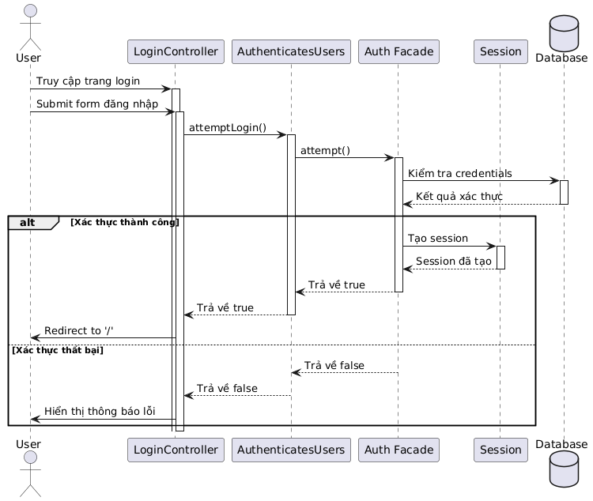
</details>

<details>
<summary>Đăng ký tài khoản</summary>
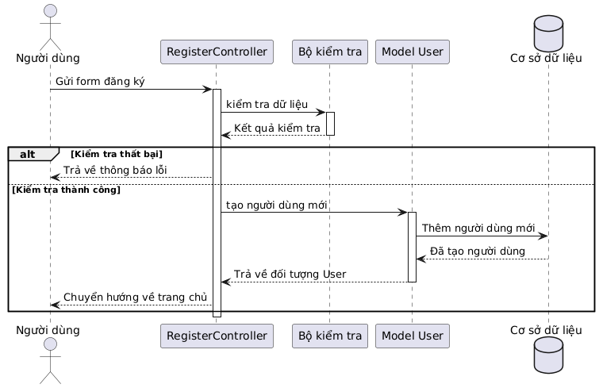
</details>

<details>
<summary>Trang chủ (Home Controller)</summary>
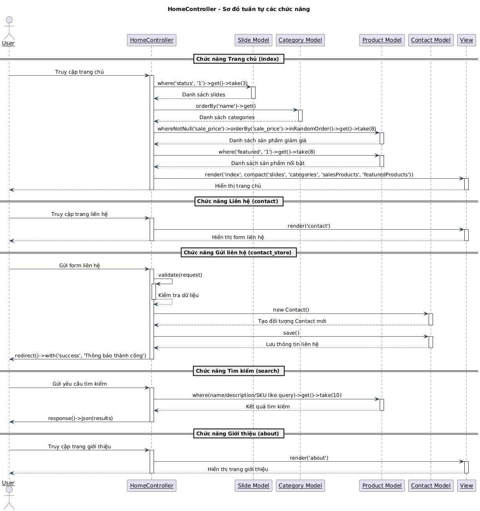
</details>

<details>
<summary>Cửa hàng (Shop Controller)</summary>
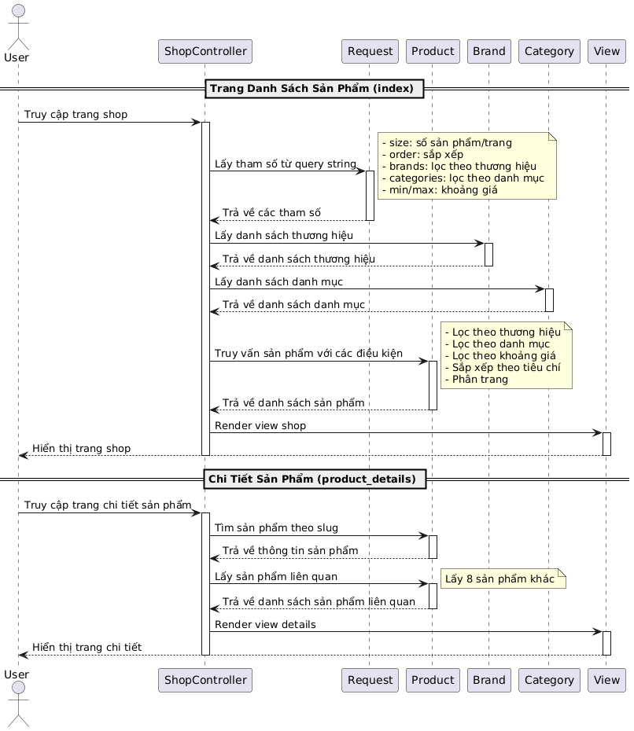
</details>

<details>
<summary>Giỏ hàng (Cart Controller)</summary>
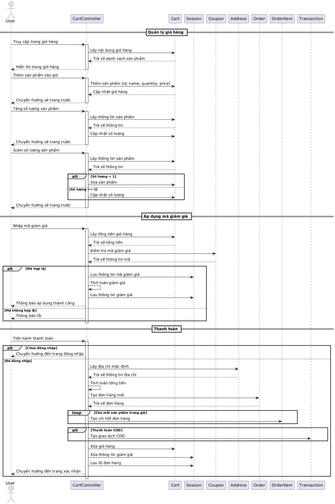
</details>

<details>
<summary>Người dùng (User Controller)</summary>
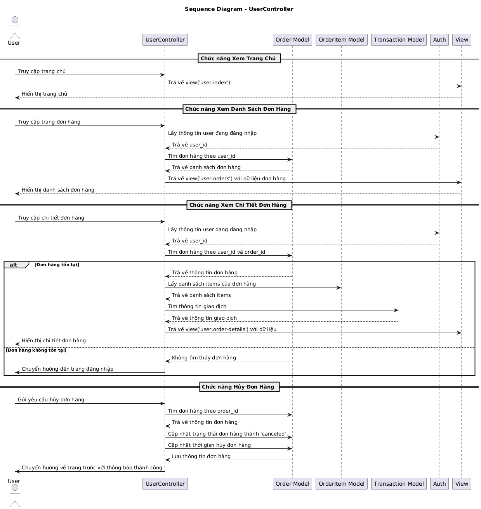
</details>

<details>
<summary>Sản phẩm yêu thích (Mong muốn)</summary>
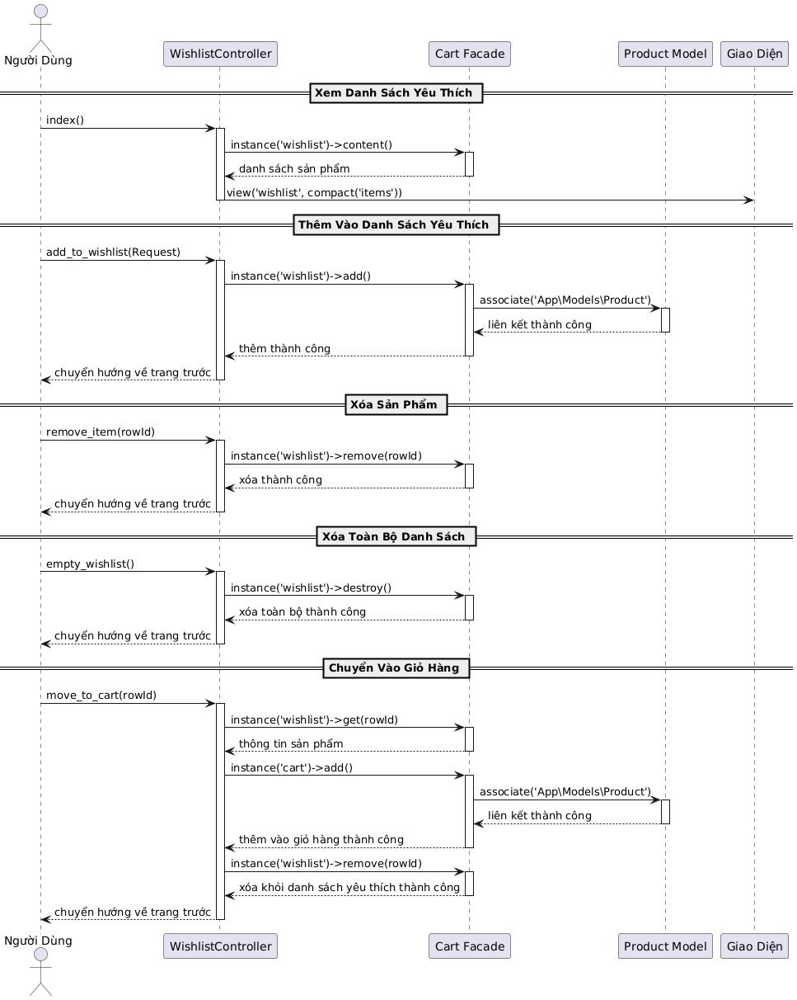
</details>

<details>
<summary>Quản lý - Bảng điều khiển</summary>
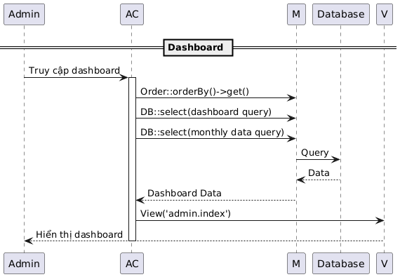
</details>

<details>
<summary>Quản lý - Cài đặt</summary>
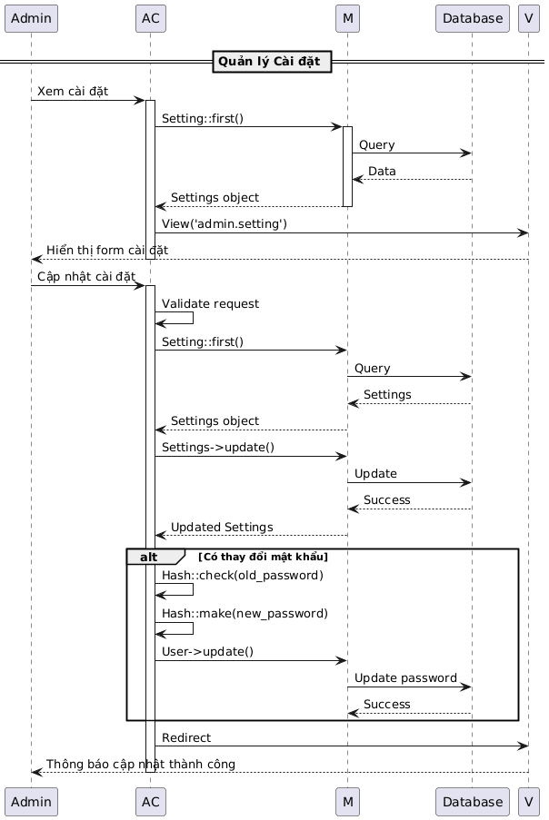
</details>

<details>
<summary>Quản lý - Danh mục</summary>
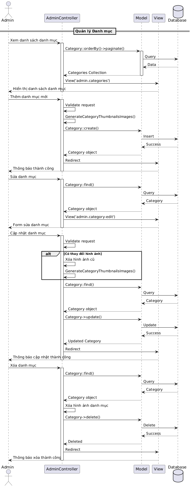
</details>

<details>
<summary>Quản lý - Đơn hàng</summary>
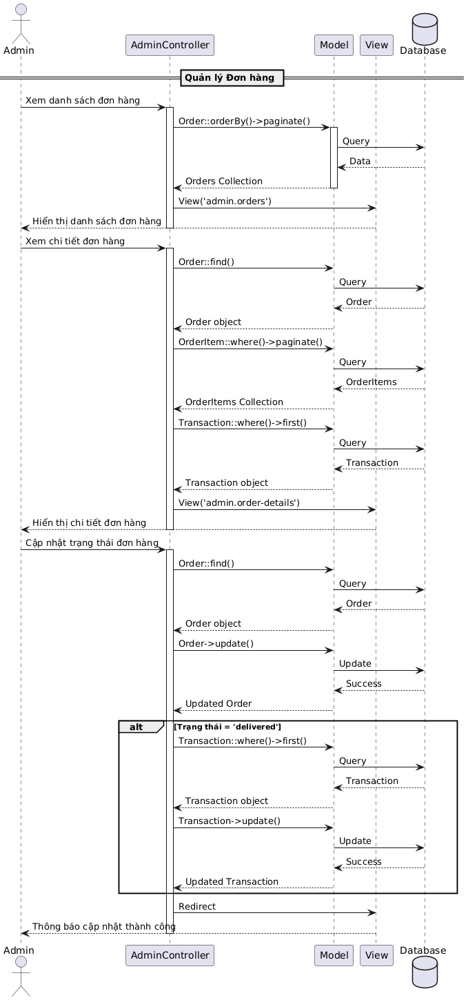
</details>

<details>
<summary>Quản lý - Liên hệ</summary>
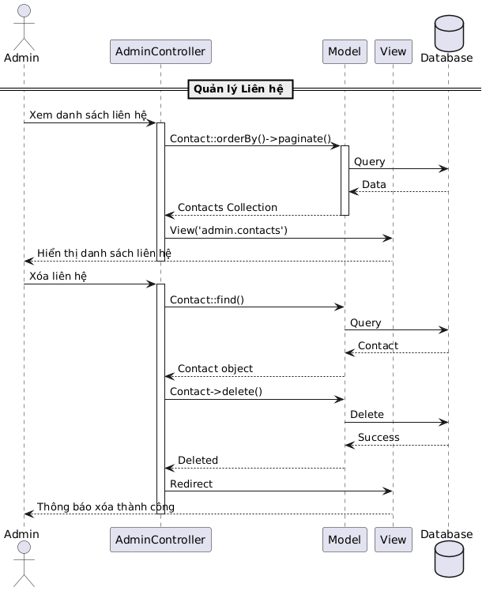
</details>

<details>
<summary>Quản lý - Mã giảm giá</summary>
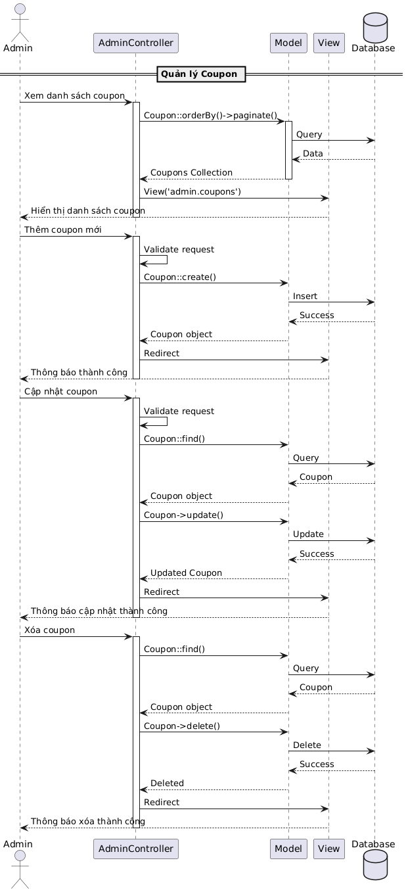
</details>

<details>
<summary>Quản lý - Sản phẩm</summary>
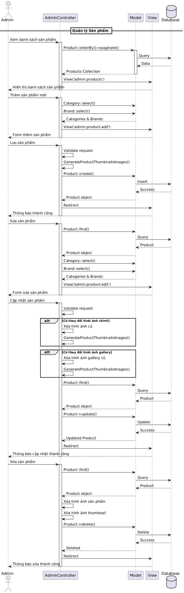
</details>

<details>
<summary>Quản lý - Slides</summary>
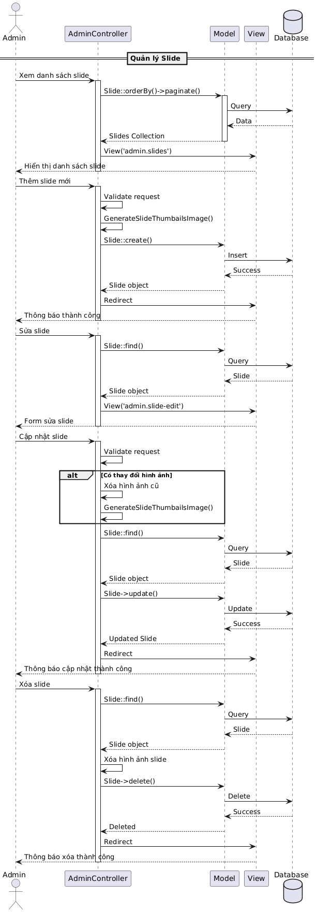
</details>

<details>
<summary>Quản lý - Thương hiệu</summary>
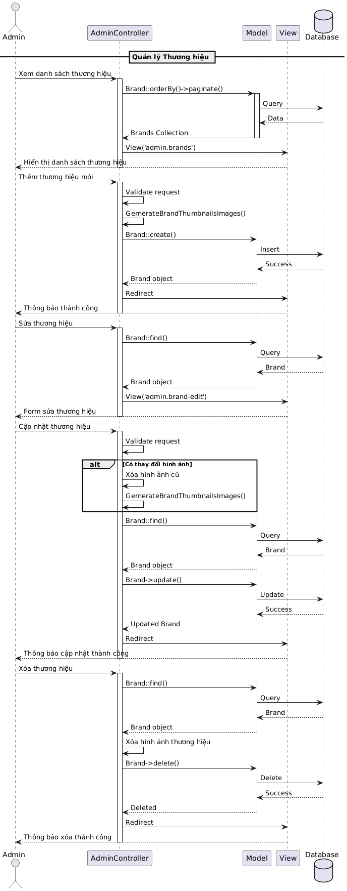
</details>

<details>
<summary>Quản lý - User</summary>
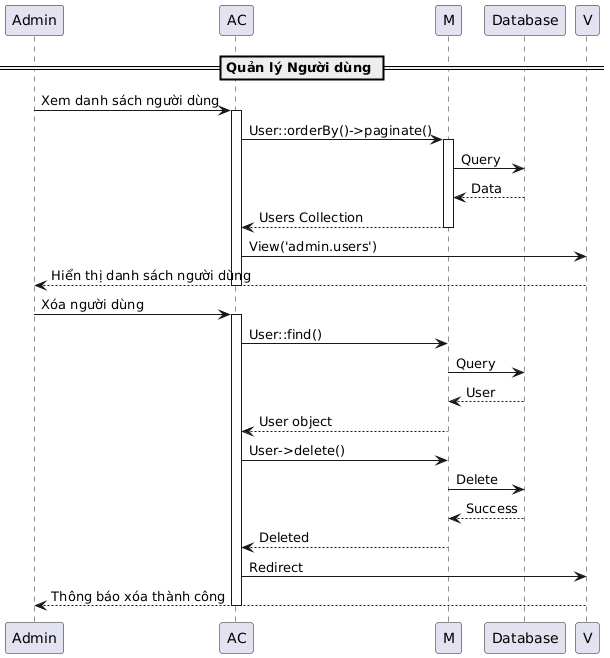
</details>

</details>

## 🔍 Phân tích một số Code chính

<details>
<summary><strong>📄 <code>app/Http/Controllers/UserController.php</code></strong></summary>

Controller này xử lý logic cho khu vực tài khoản của người dùng đã đăng nhập.

#### `index()` - Trang tổng quan
- **Mô tả:** Hiển thị trang dashboard chính cho người dùng.
- **Luồng xử lý:** Trả về view `user.index`.
```php
public function index()
{
    return view('user.index');
}
```

#### `orders()` - Lịch sử đơn hàng
- **Mô tả:** Hiển thị danh sách các đơn hàng của người dùng.
- **Luồng xử lý:** Lấy các đơn hàng của `Auth::user()`, sắp xếp mới nhất và phân trang.
```php
public function orders()
{
    $orders = Order::where('user_id', Auth::user()->id)
                    ->orderBy('created_at', 'desc')
                    ->paginate(10);
    return view('user.orders', compact('orders'));
}
```

#### `order_details($order_id)` - Chi tiết đơn hàng
- **Mô tả:** Hiển thị chi tiết một đơn hàng cụ thể.
- **Luồng xử lý:** Tìm đơn hàng theo `id` và đảm bảo nó thuộc về người dùng đang đăng nhập để bảo mật.
```php
public function order_details($order_id)
{
    $order = Order::where('user_id', Auth::user()->id)->where('id', $order_id)->first();
    if($order) {
        $orderItems = OrderItem::where('order_id', $order->id)->paginate(12);
        $transaction = Transaction::where('order_id', $order->id)->first();
        return view('user.order-details', compact('order', 'orderItems', 'transaction'));
    }
    return redirect()->route('login');
}
```
</details>

<details>
<summary><strong>📄 <code>app/Models/User.php</code></strong></summary>

Model trung tâm đại diện cho người dùng, tích hợp sẵn các chức năng xác thực của Laravel.

- **`$fillable`**: Các thuộc tính được phép gán hàng loạt (`name`, `email`, `phone`, `password`, `utype`).
- **`$hidden`**: Các thuộc tính nhạy cảm bị ẩn khi chuyển sang JSON (`password`, `remember_token`).
- **`casts()`**: Tự động chuyển đổi kiểu dữ liệu, đặc biệt là tự động **băm mật khẩu** khi gán.
```php
protected function casts(): array
{
    return [
        'email_verified_at' => 'datetime',
        'password' => 'hashed', // Tự động hash mật khẩu
    ];
}
```
- **Relationships**: Định nghĩa các mối quan hệ như `hasMany` với `Address`, `Contact`, `Setting`.
```php
public function addresses()
{
    return $this->hasMany(Address::class);
}
```
</details>

<details>
<summary><strong>📄 <code>resources/views/user/account-nav.blade.php</code></strong></summary>

Đây là file Blade tạo thanh điều hướng trong trang tài khoản người dùng, sử dụng `route()` helper của Laravel để tạo URL động và an toàn.

- **Đăng xuất an toàn:** Chức năng Đăng xuất được đặt trong một form với phương thức `POST` và token `@csrf` để tuân thủ tiêu chuẩn bảo mật, chống lại tấn công CSRF.
```html
<ul class="account-nav">
    <li><a href="{{ route('user.index') }}">Bảng điều khiển</a></li>
    <li><a href="{{ route('user.orders') }}">Đơn hàng</a></li>
    <li><a href="{{ route('user.addresses') }}">Địa chỉ</a></li>
    <li><a href="{{ route('user.details') }}">Thông tin tài khoản</a></li>
    <li><a href="{{ route('wishlist.index') }}">Danh sách yêu thích</a></li>
    <li>
        <form method="POST" action="{{ route('logout') }}" id="logout-form">
            @csrf
            <a href="{{ route('logout') }}" 
               onclick="event.preventDefault(); document.getElementById('logout-form').submit();">
                Đăng xuất
            </a>
        </form>
    </li>
</ul>
```
</details>

## ⚙️ Yêu cầu hệ thống
- **PHP:** `^8.1`
- **Composer:** `^2.0`
- **MySQL:** `>= 5.7`
- **Node.js:** `>= 16.x`
- **NPM:** `>= 8.x`

## 🔧 Hướng dẫn cài đặt

1.  **Clone repository về máy:**
    ```bash
    git clone [repository-url]
    cd phenikaa-fashion-shop
    ```

2.  **Cài đặt các gói phụ thuộc:**
    ```bash
    composer install
    npm install
    ```

3.  **Cấu hình môi trường:**
    - Sao chép tệp `.env.example` thành `.env`.
    ```bash
    cp .env.example .env
    ```
    - Tạo khóa ứng dụng mới.
    ```bash
    php artisan key:generate
    ```

4.  **Cấu hình cơ sở dữ liệu trong tệp `.env`:**
    ```env
    DB_CONNECTION=mysql
    DB_HOST=127.0.0.1
    DB_PORT=3306
    DB_DATABASE=phenikaa_fashion
    DB_USERNAME=root
    DB_PASSWORD=
    ```

5.  **Chạy Migrations và Seeders để tạo cấu trúc bảng và dữ liệu mẫu:**
    ```bash
    php artisan migrate --seed
    ```

6.  **Biên dịch tài nguyên frontend:**
    ```bash
    npm run build
    ```

7.  **Khởi chạy máy chủ phát triển:**
    ```bash
    php artisan serve
    ```
    Ứng dụng sẽ chạy tại: `http://127.0.0.1:8000`

## 🤝 Đóng góp
Mọi đóng góp đều được hoan nghênh! Vui lòng thực hiện theo các bước sau:
1.  **Fork** repository này.
2.  Tạo một branch mới (`git checkout -b feature/AmazingFeature`).
3.  Commit các thay đổi của bạn (`git commit -m 'Add some AmazingFeature'`).
4.  Push lên branch (`git push origin feature/AmazingFeature`).
5.  Mở một **Pull Request**.

## 📄 Giấy phép
Dự án này được cấp phép theo **MIT License**. Xem chi tiết tại tệp [LICENSE](LICENSE).

---
<div align="center">
  Cảm ơn bạn đã ghé thăm!
</div>
